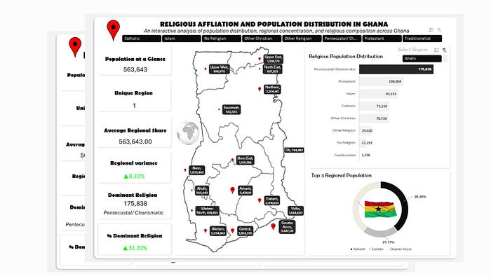

# Excel Projects

A curated collection of practical Microsoft Excel analytics projects. Each project is organized as a self-contained case study with documentation, methodology, visual assets, and reproducible analytical guidance.

## Table of Contents

- [Featured Project](#featured-project)
- [Repository Structure](#repository-structure)
- [How to Use This Repository](#how-to-use-this-repository)
- [Project Standards](#project-standards)
- [Source and Attribution](#source-and-attribution)

## Featured Project

### [Religious Affiliation and Population Distribution in Ghana](./ghana-religious-affiliation-and-population-distribution/)

An interactive Excel data analytics case study that transforms regional population and religious affiliation data into an accessible dashboard. The project demonstrates data preparation, Pivot Table analysis, derived metrics, ranking logic, and interactive dashboard design across Ghana’s 16 administrative regions.

The featured project includes a detailed project README, supporting documentation, analytical formulas, dataset guidance, and locally stored illustrations for reliable rendering on GitHub.

## Repository Structure

| Path | Purpose |
| --- | --- |
| `ghana-religious-affiliation-and-population-distribution/` | Self-contained project folder for the Ghana demographic analytics case study. |
| `ghana-religious-affiliation-and-population-distribution/README.md` | Project narrative, table of contents, methodology, insights, and visual documentation. |
| `ghana-religious-affiliation-and-population-distribution/docs/` | Extended analytical notes and documentation. |
| `ghana-religious-affiliation-and-population-distribution/data/` | Data guidance and provenance notes. |
| `ghana-religious-affiliation-and-population-distribution/assets/` | Illustrations used in the project documentation. |

## How to Use This Repository

Start with the project folder linked above, then read its README from top to bottom. The documentation is designed to explain the analytical question, data preparation workflow, Pivot Table structure, dashboard logic, and interpretation considerations before a workbook is opened or recreated.

The repository currently documents the analytical project and preserves its illustrations. The original article does not expose a downloadable workbook through the accessible page, so no fabricated or unverified `.xlsx` file has been added.

## Project Standards

Projects in this repository are expected to document their analytical purpose, data assumptions, cleaning decisions, calculation logic, visual design, limitations, and source attribution. Where possible, each project should preserve the assets required to render its documentation consistently on GitHub.

## Source and Attribution

The featured project is based on Adeyemi Adenuga’s article, [Religious Affiliation and Population Distribution in Ghana: An Interactive Excel Data Analytics Project](https://medium.com/@adeyemi.da/religious-affiliation-and-population-distribution-in-ghana-an-interactive-excel-data-analytics-3e18a5de1edf). Illustrations are included locally for documentation and illustration purposes and remain attributed to the original source. Please review the original publication and its rights statement before reusing the images elsewhere.
