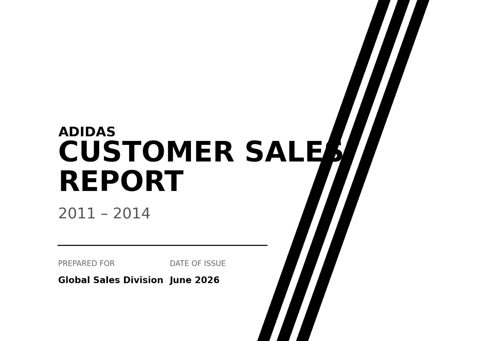
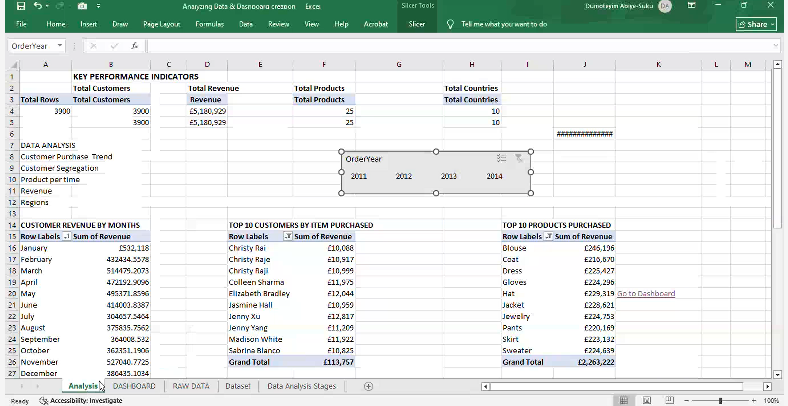
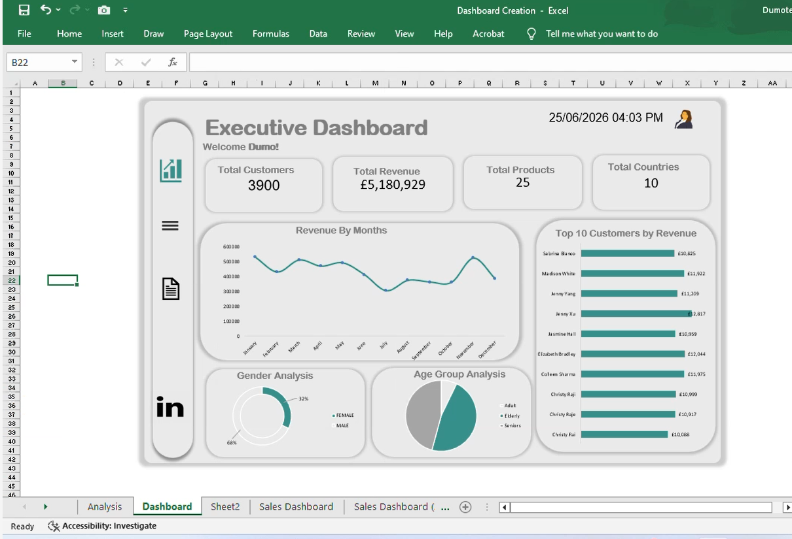
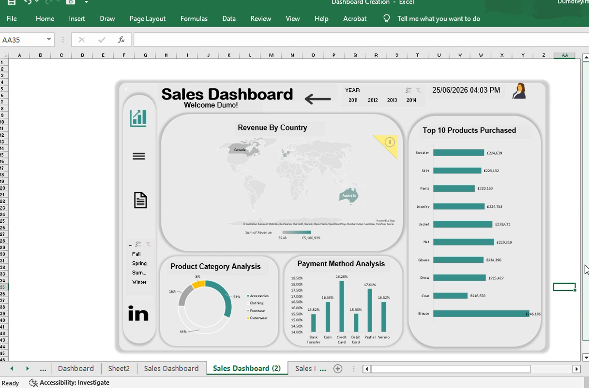

# Adidas Customer Sales Report (2011-2014)

## Introduction
This project presents a comprehensive **Adidas Customer Sales Analysis and Interactive Dashboard** built in Microsoft Excel. The analysis covers sales data from **2011 to 2014**, providing key performance insights into customer behavior, revenue trends, product performance, and geographic distribution.

The solution includes raw data processing, pivot tables, interactive slicers, and polished executive dashboards for data-driven decision making.

## Objective
The main objectives of this project were to:
- Analyze historical sales performance of Adidas products across multiple years.
- Identify top-performing customers, products, and regions.
- Understand seasonal revenue patterns and customer demographics (gender & age groups).
- Create interactive dashboards for executive-level insights and easy filtering by year.
- Provide actionable recommendations to improve sales strategy.

## Data Source
- **Dataset**: Adidas Customer Sales dataset (raw data sheet).
- **Time Period**: 2011 – 2014.
- **Records**: 3,900 rows.
- **Source Format**: Excel workbook with multiple sheets (Raw Data, Analysis, Dashboard).

## Data Types
The dataset includes the following key fields:
- **OrderYear** (2011–2014)
- **Customer Information** (Customer names, demographics)
- **Product Details** (Product Category, Item Purchased)
- **Transaction Data** (Revenue, Payment Method)
- **Geographic Data** (Country)
- **Temporal Data** (Month, Order Date)
- **Demographic Data** (Gender, Age Group)

## Analysis
### Key Performance Indicators (KPIs)
- **Total Customers**: 3,900
- **Total Revenue**: £5,180,929
- **Total Products**: 25
- **Total Countries**: 10

### Revenue by Month
Monthly revenue shows seasonal fluctuations with peaks in certain months (e.g., November and March showed strong performance in the data).

### Top 10 Customers by Revenue
- Christy Rai, Christy Raje, Colleen Sharma, Elizabeth Bradley, etc.
- Highest revenue from a single customer group exceeded £10,000–£12,000 range.

### Top 10 Products
- Blouse, Coat, Dress, Gloves, Hat, Jacket, Jewelry, Pants, Skirt, Sweater.

## Visualization
The project features two main interactive dashboards:

### 1. Executive Dashboard
- **KPIs Cards**: Total Customers, Revenue, Products, Countries.
- **Revenue by Months** – Line chart showing trend across the year.
- **Top 10 Customers** – Horizontal bar chart.
- **Gender Analysis** – Pie chart (68% Male, 32% Female).
- **Age Group Analysis** – Pie chart (Adult dominant).

### 2. Sales Dashboard
- **Revenue by Country** – World map highlighting key markets (e.g., Canada, Australia).
- **Top 10 Products** – Bar chart.
- **Product Category Analysis** – Donut/Pie chart (Clothing, Footwear, Accessories, Outerwear).
- **Payment Method Analysis** – Bar chart showing distribution (Credit Card, PayPal, etc.).
- Interactive **Year Slicer** (2011–2014) for dynamic filtering.

All visualizations are connected via slicers for real-time interactivity.

## Findings
- **Revenue Concentration**: A small number of customers and products drive the majority of revenue.
- **Seasonality**: Clear monthly peaks and troughs in sales.
- **Demographics**: Male customers dominate purchases; Adults form the largest age segment.
- **Geography**: Strong performance in select countries (Canada and Australia highlighted).
- **Product Performance**: Clothing items (especially Blouse, Jacket, Coat) lead in revenue.
- **Payment Trends**: Digital/modern methods (PayPal, Credit Card) are popular.

## Recommendations
1. **Focus on High-Value Customers**: Implement loyalty programs for top 10 customers.
2. **Seasonal Marketing**: Boost campaigns during high-revenue months (e.g., November, March).
3. **Product Strategy**: Increase inventory and marketing for top-performing items (Blouse, Jacket, etc.).
4. **Geographic Expansion**: Strengthen presence in high-performing countries and explore new markets.
5. **Demographic Targeting**: Tailor campaigns for male adult customers while exploring growth opportunities in female segments.
6. **Payment Optimization**: Promote preferred payment methods to reduce friction.

## Connect
**Created by**: Dumoteyim Abiye-Suku

**Tools Used**:
- Microsoft Excel (Pivot Tables, Slicers, Charts, Dashboard Design)
- Data Cleaning & Transformation

**Feel free to connect**:
- For collaboration, feedback, or similar data projects.
- LinkedIn / GitHub: [https://www.linkedin.com/in/pearladeyemi]

---

*Project Date: June 2026*  
*All rights reserved. Data used for demonstration and learning purposes.*
