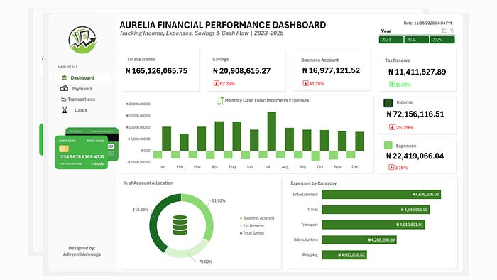
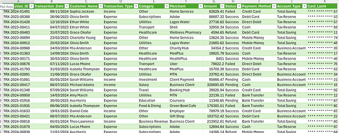
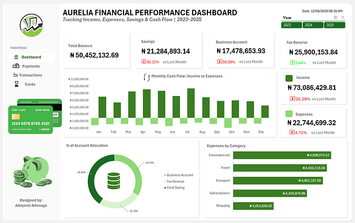

# Financial Health & Cash Flow Performance Dashboard

> **An interactive Microsoft Excel dashboard for understanding financial performance, spending patterns, savings growth, cash flow, and fund allocation.**



## Table of Contents

- [Project Overview](#project-overview)
- [Objectives](#objectives)
- [Business Scenario](#business-scenario)
- [Dataset](#dataset)
- [Data Cleaning and Transformation](#data-cleaning-and-transformation)
- [Analysis](#analysis)
- [Pivot Tables](#pivot-tables)
- [Dashboard](#dashboard)
- [Key Insights](#key-insights)
- [Recommendations](#recommendations)
- [Tools Used](#tools-used)
- [Project Structure](#project-structure)
- [Workbook Availability](#workbook-availability)
- [Conclusion](#conclusion)
- [Source and Attribution](#source-and-attribution)

## Project Overview

Aurelia Financial Services is a fictional financial services company used for this analytics project. The company manages income, operating expenses, business funds, savings, and tax reserves across its financial activities.

This project analyzes Aurelia’s transactional records from **2023 to 2025** to provide visibility into financial position, cash-flow patterns, spending behavior, savings performance, and the allocation of funds. The dashboard is designed to support financial monitoring and decision-making through a single interactive Excel reporting experience.

The analysis addresses practical management questions, including how much money is available, how much income has been generated, how much has been spent, where funds are held, which expense categories consume the most resources, how monthly cash flow changes, and how key indicators compare with the previous period.

## Objectives

The documented objectives are to clean and standardize three years of financial transaction data, create KPI indicators for key financial metrics, analyze monthly income and expenses, identify major expense categories, and analyze the allocation of funds across accounts.

## Business Scenario

Aurelia’s raw transactional records contain income, expenses, savings activity, business-account movements, tax reserves, payment methods, transaction statuses, and other financial activity. The source documentation identifies common data-quality challenges, including inconsistent formatting, missing values, positive and negative financial values, and inconsistent date formats.

The dashboard addresses this problem by transforming the raw transactions into an analysis-ready structure and presenting the resulting metrics through interactive Excel visuals.

## Dataset

The dataset represents transactional financial activity between **2023 and 2025**. The documented transaction view includes fields such as transaction date, transaction type, category, merchant, amount, status, payment method, account type, and card information.



The source documentation describes the dataset at a project level but does not provide a complete downloadable data dictionary in the article. The repository therefore does not infer additional fields, definitions, or records beyond what is visible in the documented transaction view.

## Data Cleaning and Transformation

Data preparation was performed in **Power Query within Excel**. Date fields were converted to proper Date types and monetary fields were converted to appropriate decimal-number formats.

The `Amount` field was examined for errors, missing values, currency symbols, commas, and related inconsistencies. Negative values were retained when they represented expenses because the sign is useful for cash-flow analysis.

### New Amount

A `New Amount` field was created to standardize the financial direction of transactions. Income is represented as positive and expenses as negative. The documented transformation logic is:

```powerquery
if [Transaction_Type] = "Expense"
then -[Amount]
else [Amount]
```

### KPI Columns

The documented custom columns include `Total Income`, `Total Expense`, `Total Balance`, `Business Account`, `Total Savings`, and `Tax Reserve`. These fields were subsequently aggregated through PivotTables.

### Calendar Table

A separate Date Table was created in Power Query for time-based analysis. It begins on **1 January 2023** and dynamically extends to the current date. The table supports analysis by year, quarter, month, year-month, and date, enabling both year-over-year and month-over-month analysis.

The article documents the following date-list expression:

```powerquery
= List.Dates(
    #date(2023, 1, 1),
    365,
    #duration(1, 0, 0, 0)
)
```

## Analysis

The analysis focuses on financial position, monthly cash flow, expense composition, KPI movement, and account allocation. Income is displayed as a positive inflow, while expenses remain negative in the cash-flow visual to distinguish money leaving the organization.

The monthly analysis supports identification of months with strong income, higher spending, changing cash-flow patterns, significant expense increases, and unusual periods requiring further investigation. The expense analysis compares categories such as Entertainment, Travel, Transport, Subscriptions, and Shopping.

## Pivot Tables

PivotTables form the aggregation layer between the cleaned transaction table and the dashboard. They aggregate the custom KPI fields and provide the summaries required for monthly cash flow, expense categories, account allocation, and comparison indicators.

The documented workflow uses PivotTables together with PivotCharts, slicers, a timeline, calculated fields or custom columns, and a dedicated Calendar Table. This structure allows the dashboard to respond to time and transaction-context selections without changing the underlying raw records.

## Dashboard



The dashboard uses a financial storytelling structure built around six major indicators: **Total Balance, Savings, Business Account, Tax Reserve, Income, and Expenses**.

| Dashboard element | Documented purpose |
| --- | --- |
| Total Balance | Shows the net financial position derived from the captured transactions. |
| Savings | Shows the current value associated with savings activity and a percentage change indicator. |
| Business Account | Shows the balance associated with the operating account. |
| Tax Reserve | Shows funds allocated for future tax obligations. |
| Income | Shows total successful income transactions and a comparison indicator. |
| Expenses | Shows total successful expenses, presented positively in the KPI while remaining negative in the cash-flow visual. |
| Monthly Cash Flow | Uses a clustered column chart to compare income and expenses by month. |
| Expenses by Category | Uses a horizontal bar chart to rank expense categories. |
| Account Allocation | Uses a doughnut chart to show Business Account, Tax Reserve, and Total Savings. |

The central cash-flow chart places income above the zero line and expenses below it. The expense-category chart uses a horizontal orientation to make category ranking easier to read. The account-allocation doughnut chart provides a visual overview of where financial resources are held.

## Key Insights

The following results are reported in the source documentation and are reproduced here without modification.

| Metric or finding | Documented result |
| --- | --- |
| Total income | **₦73.09 million** |
| Total expenses | **₦22.74 million** |
| Total Balance | **₦50.45 million** |
| Savings balance | **₦21.28 million**, with a **63.21% decrease** versus the previous month |
| Business Account balance | **₦17.48 million**, with a **50.50% decline** versus the previous month |
| Tax Reserve | **₦25.90 million**, with a **5.64% increase** versus the previous month |
| Expenses as a share of income | Approximately **31%** |
| Largest expense categories | Entertainment, Travel, and Transport; Subscriptions and Shopping follow closely |
| Monthly cash flow | Income remains above expenses across the displayed months, with variation in monthly income |
| Account allocation | Approximately **40.48% Savings**, **33.74% Business Account**, and **25.78% Tax Reserve** |

The source article interprets the income and expense figures as a positive overall financial position, while highlighting the declines in Savings and Business Account as movements requiring investigation. It also describes the expense distribution as relatively even because no single category overwhelmingly dominates spending.

## Recommendations

The documented recommendations are to investigate the 63.21% decline in Savings at transaction level, determine whether it reflects transfers, withdrawals, investments, or unexpected expenditure, and establish a minimum savings threshold with consistent monthly contributions.

Management is also advised to review the 50.50% Business Account decline and reconcile the transactions responsible for it, distinguishing operational expenses, transfers, withdrawals, and other account movements. The source recommends maintaining regular Tax Reserve allocations and comparing the reserve periodically with projected tax obligations.

Additional recommendations include introducing monthly budgets and spending limits for discretionary categories, monitoring the approximately 31% expense-to-income ratio as a baseline, and investigating unusual monthly income or expense fluctuations at transaction level to distinguish seasonality, one-off transactions, transfers, or potential data anomalies.

## Tools Used

| Tool or capability | Use in the project |
| --- | --- |
| Microsoft Excel | Workbook development and dashboard delivery. |
| Power Query | Data cleaning, transformation, custom columns, and Date Table creation. |
| PivotTables | Aggregation of financial metrics and analytical summaries. |
| PivotCharts | Visual reporting of cash flow and category analysis. |
| Slicers and Timeline | Interactive filtering and time-based navigation. |
| Data modelling | Organization of transaction and calendar information for reporting. |
| Conditional formatting | Visual emphasis for KPI movements and comparisons. |
| Dashboard design | Financial storytelling and management-oriented presentation. |

The source documentation also identifies data transformation, data quality management, KPI development, time-series analysis, variance analysis, month-over-month analysis, and financial storytelling as demonstrated analytics concepts.

## Project Structure

```text
financial-health-cash-flow-performance-dashboard/
├── README.md
└── Images/
    ├── README.md
    ├── dashboard-overview.jpeg
    ├── raw-transactions.png
    └── financial-performance-dashboard.png
```

## Workbook Availability

The supplied article and accessible article extraction document the dashboard and its methods but do not expose a downloadable `.xlsx` file or workbook attachment. To comply with the requirement not to invent information or artifacts, no fabricated Excel project file has been added.

When the original workbook is available, it should be added to this folder with a descriptive filename such as `Aurelia-Financial-Performance-Dashboard.xlsx`, together with its source, version, refresh date, and any usage terms. The README should then be updated with a working relative link to that verified file.

## Conclusion

The documented project demonstrates how Excel can transform multi-year financial transactions into an interactive dashboard for monitoring financial position, cash flow, spending patterns, savings performance, tax reserves, and account allocation. Its workflow combines Power Query preparation, custom financial-direction logic, a dynamic Date Table, PivotTables, PivotCharts, slicers, a timeline, and dashboard design.

The project’s main management signal is that income exceeds recorded expenses, while the declines in Savings and Business Account balances merit transaction-level review. The dashboard provides a structured starting point for that review without replacing detailed reconciliation or financial controls.

## Source and Attribution

This project is based exclusively on the documentation in Adeyemi Adenuga’s article, [Financial Health & Cash Flow Performance Dashboard](https://medium.com/@adeyemi.da/financial-health-cash-flow-performance-dashboard-6a96dc9d255d). The documented professional profile link is [Adeyemi Adenuga on LinkedIn](https://www.linkedin.com/in/pearladeyemi).

The images in the `Images/` folder were downloaded from image URLs embedded in the original article and are retained for project illustration and documentation. Reuse outside this repository should comply with the original author’s rights and licensing terms.

### References

[1]: [Adenuga, Adeyemi. “Financial Health & Cash Flow Performance Dashboard.” Medium.](https://medium.com/@adeyemi.da/financial-health-cash-flow-performance-dashboard-6a96dc9d255d)

[2]: [Adeyemi Adenuga on LinkedIn.](https://www.linkedin.com/in/pearladeyemi)
