# FoodMeal Sales and Order Performance Report

> **How is FoodMeal performing, what are customers buying, and where are the opportunities to improve?**

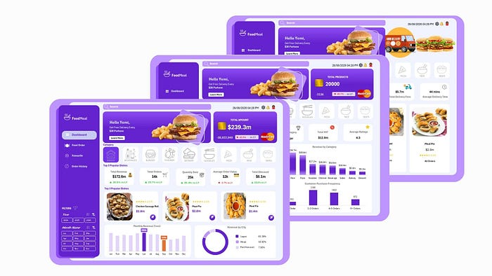

## Table of Contents

- [Project Overview](#project-overview)
- [Objectives](#objectives)
- [Dataset](#dataset)
- [Data Cleaning](#data-cleaning)
- [Analysis](#analysis)
- [Pivot Tables and Data Model](#pivot-tables-and-data-model)
- [Dashboard](#dashboard)
- [Key Insights](#key-insights)
- [Recommendations](#recommendations)
- [Tools Used](#tools-used)
- [Project Structure](#project-structure)
- [Excel Project File](#excel-project-file)
- [Conclusion](#conclusion)
- [Source and Attribution](#source-and-attribution)

## Project Overview

The FoodMeal Sales and Order Performance Report is a business intelligence project designed to monitor food-ordering performance across products, categories, customers, cities, revenue, discounts, and delivery operations. It transforms transaction-level food-order data into an accessible management view for evaluating product performance, customer behavior, operational efficiency, and geographic growth.

The documented solution uses an interactive three-page dashboard. It combines summary cards, product tiles, category navigation, monthly trend visuals, city-level revenue distribution, and order-operations indicators so users can move from an overall performance view to more focused business questions.

## Objectives

The project addresses three documented business questions:

1. How is FoodMeal performing financially?
2. Which products and categories are driving sales?
3. Who are the customers, how frequently do they purchase, and how efficiently are orders delivered?

## Dataset

The FoodMeal dataset is a fast-food transactional dataset designed to simulate the operations of a multi-outlet food business. It contains transaction-level information about orders, products, categories, customers, outlets, cities, order types, payment methods, order status, quantity, unit prices, revenue or transaction amounts, discounts, VAT, delivery fees, delivery time, customer ratings, and transaction dates.

The dataset supports analysis across year, month, outlet, city, product, and category. The product catalogue contains **36 products across nine categories**:

| Product category |
| --- |
| Bakery |
| Beverages |
| Burger |
| Chicken |
| Dessert |
| Noodles |
| Pizza |
| Rice |
| Sides |

Customer-level information also supports purchase-frequency and customer-loyalty analysis.

### Documented Dataset Illustrations

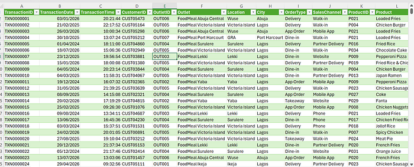

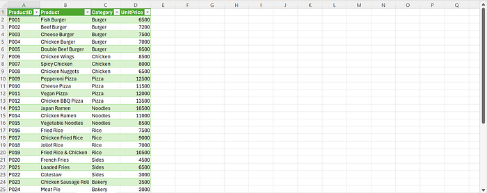

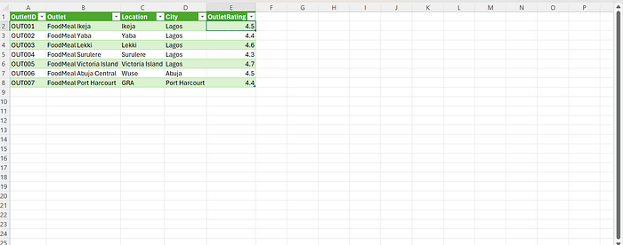

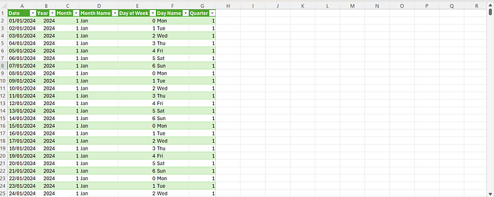

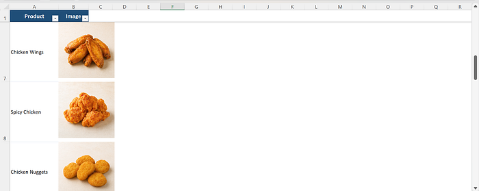

## Data Cleaning

The transaction data was prepared in Microsoft Excel using Power Query. The documented cleaning workflow focused on improving accuracy, consistency, and suitability for analysis.

### Data Type Validation

Dates were converted to appropriate date formats. Numerical fields, including Quantity, Unit Price, Total Amount, Discount, VAT, Delivery Fee, Delivery Time, and Customer Rating, were checked to ensure they were stored as numerical values.

### Standardization

Categorical fields were standardized so that equivalent values were not treated as separate categories. The documented fields include Order Status, Order Type, Payment Method, Product Category, Outlet, and City.

### Duplicate and Consistency Checks

Transaction records were reviewed for duplicate or inconsistent records. Key transaction identifiers were used to distinguish transactions appropriately.

### Data Preparation

After cleaning, the data was prepared for analysis using Power Pivot and PivotTables. A data model was established to support calculated measures and interactive reporting.

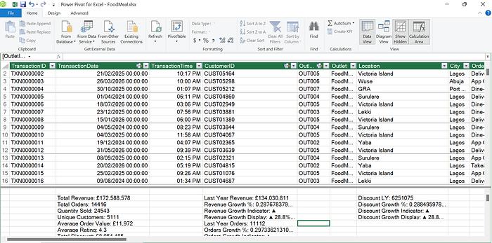

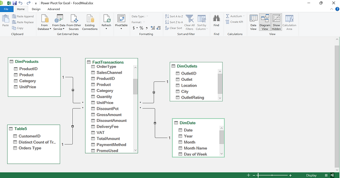

## Analysis

The analysis examines revenue, order volume, quantity sold, average order value, discounts, products, monthly performance, geographic distribution, customers, and order operations. Completed transactions are used in the documented measures for revenue, orders, quantity, discount, and rating. Delivery time is calculated for completed delivery orders.

### Documented Measures

| Measure | Documented purpose |
| --- | --- |
| Total Revenue | Sum of `Transactions[TotalAmount]` for completed orders. |
| Total Orders | Count of completed transaction rows. |
| Quantity Sold | Sum of quantity for completed orders. |
| Average Order Value | Total Revenue divided by Total Orders. |
| Total Discount | Sum of discount amount for completed orders. |
| Average Rating | Average customer rating for completed orders. |
| Average Delivery Time | Average delivery time for completed delivery orders. |
| Product Categories | Distinct count of transaction categories. |
| Top Category | Category with the highest total revenue. |
| Growth measures | Current-period values compared with the prior year using the Calendar table. |

The project also documents growth indicators that display an upward arrow, downward arrow, or dash alongside a percentage comparison with the prior year. The source includes examples such as `▲ 12.5% vs LY` and `▼ 2.4% vs LY` as display patterns; these examples are not presented as project results.

### Revenue and Volume Performance

The dashboard reports **$172.6m** in total revenue, up **28.8%** versus last year. Total orders increased to **14k**, up **29.7%**, while quantity sold reached **25k**, up **29.4%**. Average order value is shown at approximately **12k**, down **0.7%** versus last year. Total discounts are reported at **$8.1m**, up **28.8%** versus last year.

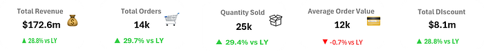

### Product Performance

The leading products displayed in the dashboard are **Pepperoni Pizza at $10.2m**, **Cheese Burger at $10.0m**, **Chicken Fried Rice at $9.3m**, and **Fried Rice & Chicken at $9.0m**. The article reports these four products at approximately **$38.5m** in combined displayed revenue. Ratings for popular dishes are described as approximately 4.2 to 4.3 out of 5.

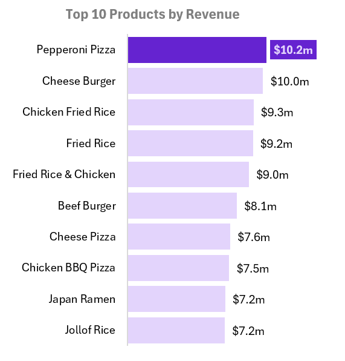

### Monthly Performance

The documented monthly view shows January at approximately **$23.2m**, the strongest clearly labeled month in the visual, while September is shown at approximately **$15.0m**. The article describes a reduction around August and September followed by some recovery later in the year.

### Geographic Performance

Revenue is reported as concentrated in Lagos, which contributes **81.16%** of displayed city revenue. Abuja contributes **10.92%**, while Port Harcourt contributes **7.92%**. The article identifies Lagos as the core market and describes the concentration as a geographic risk.

### Order Operations

The related order dashboard reports **14k total orders**, **4k cancelled orders**, **2k refunded orders**, **$5.7m in delivery fees**, and an average delivery time of **44 minutes**. The article states that, if cancellation and refund counts use the same 14k order base, cancellations represent approximately **28.6%** and refunds approximately **14.3%** of orders.

The source recommends analyzing cancellation and refund causes separately rather than treating them as one problem.


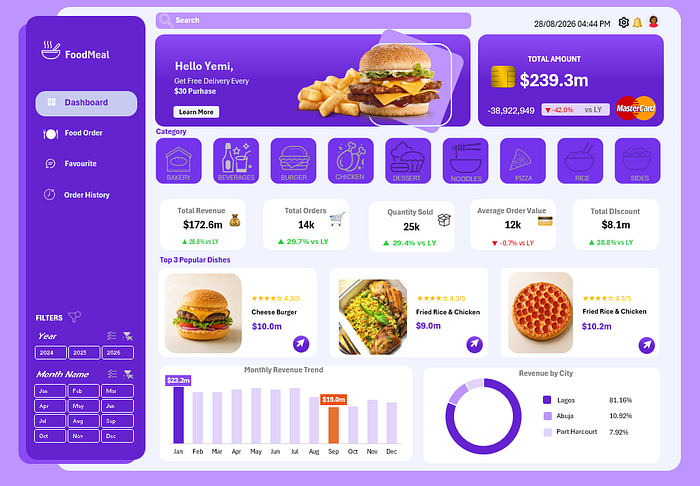

## Pivot Tables and Data Model

Power Pivot and PivotTables provide the aggregation and modelling layer behind the dashboard. The cleaned transactions are organized into a data model so calculated measures can be used consistently across product, category, customer, outlet, city, order type, payment method, status, and time-based views.

The dashboard workflow combines PivotTables with DAX measures, slicers, category navigation, and a Calendar table. The documented Calendar table supports year-over-year and period-based comparisons used by the growth measures.

## Dashboard

The FoodMeal solution is described as an interactive three-page dashboard with an executive-facing structure. A left-side navigation panel provides access to dashboard, food-order, favourite, and order-history views. Year and month filters support period-based analysis, while category controls cover Bakery, Beverages, Burger, Chicken, Dessert, Noodles, Pizza, Rice, and Sides.

| Dashboard area | Documented purpose |
| --- | --- |
| Summary cards | Present high-level revenue, order, volume, discount, rating, and delivery indicators. |
| Product tiles | Highlight leading products and their displayed performance. |
| Monthly trend visuals | Show revenue and operating performance across time. |
| City revenue distribution | Compare geographic contribution, including Lagos, Abuja, and Port Harcourt. |
| Order-operations indicators | Surface cancellations, refunds, delivery fees, and average delivery time. |
| Category navigation | Allow focused analysis of the nine documented food categories. |
| Year and month filters | Support period-based exploration. |

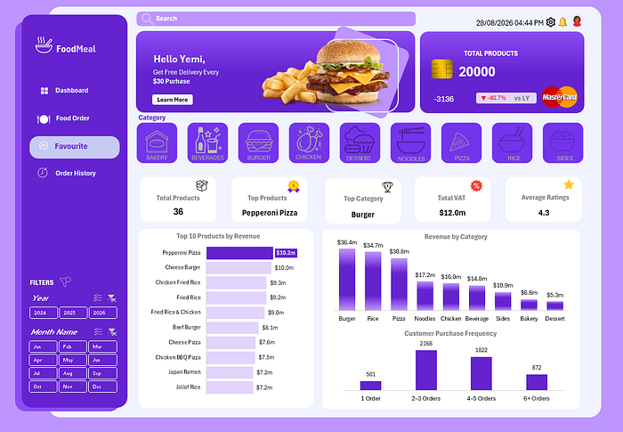

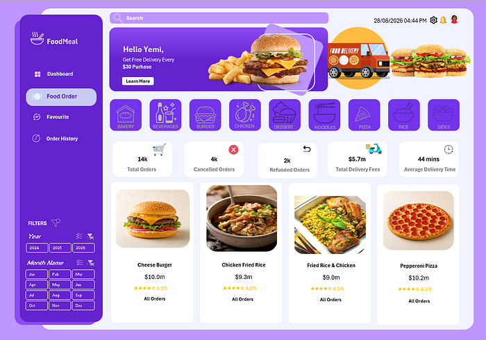

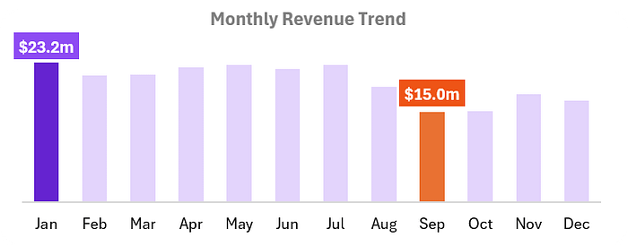

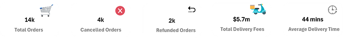

## Key Insights

The documented analysis indicates strong year-on-year growth in revenue, orders, and quantity sold, but this growth is described as volume-led because average order value declined slightly. The article therefore identifies basket expansion as an opportunity through bundles, add-ons, premium substitutions, and personalized recommendations.

A small group of products drives a significant share of visible revenue. Pepperoni Pizza, Cheese Burger, Chicken Fried Rice, and Fried Rice & Chicken are identified as priority products for availability, quality control, inventory planning, and promotional planning.

Lagos dominates displayed city revenue at 81.16%. This demonstrates market traction but also limited geographic diversification, making controlled expansion into Abuja and Port Harcourt a potential opportunity.

Operational reliability is highlighted as a possible constraint. The documented cancellation, refund, and delivery-time indicators suggest that value may be lost after customers place orders. The article also calls attention to dashboard-governance issues, including conflicting year-on-year indicators for Total Amount and Total Revenue and an apparent product-card label mismatch.

The conclusion also notes a substantial repeat-customer base, particularly customers making 2–5 purchases, and an overall customer rating of approximately **4.3/5**.

## Recommendations

The source documentation proposes five recommendation areas. First, increase average order value by testing meal bundles, checkout recommendations, premium-size upgrades, dessert add-ons, and threshold-based incentives.

Second, protect and develop bestselling products by prioritizing stock planning and preparation capacity for Pepperoni Pizza, Cheese Burger, Chicken Fried Rice, and Fried Rice & Chicken. Product monitoring should cover availability, preparation time, cancellation rate, refund rate, rating, and repeat purchase.

Third, reduce cancellations, refunds, and delivery delays through root-cause analysis across restaurant, courier, customer, payment, and platform causes. The article recommends earlier courier assignment, optimized delivery zones, and targeted support for repeated stockout or late-preparation problems.

Fourth, use discounts more efficiently by assessing promotions by customer segment and product, and by measuring incremental orders, basket-size impact, and contribution margin rather than order growth alone.

Fifth, expand selectively outside Lagos through targeted campaigns, local restaurant partnerships, city-specific menus, and improved delivery coverage. The proposed city-level measures include order growth, customer acquisition cost, average order value, delivery time, cancellation rate, refund rate, and contribution margin.

## Tools Used

| Tool or capability | Role in the project |
| --- | --- |
| Microsoft Excel | Workbook development and dashboard delivery. |
| Power Query | Data cleaning and preparation. |
| Power Pivot | Data model and measure infrastructure. |
| DAX | Calculated measures and year-on-year comparisons. |
| PivotTables | Aggregation and interactive reporting. |
| Data visualization | Dashboard charts, cards, product tiles, and geographic views. |

## Project Structure

```text
foodmeal-sales-and-order-performance-report/
├── README.md
└── Images/
    ├── README.md
    ├── dashboard-overview.jpeg
    ├── dataset-01.png ... dataset-05.png
    ├── data-preparation-01.png
    ├── data-preparation-02.png
    ├── revenue-analysis.png
    ├── product-analysis.png
    └── operations-01.png ... operations-06.png
```

## Excel Project File

The supplied Medium article documents the FoodMeal dashboard, methods, measures, results, and screenshots, but it does not expose a downloadable `.xlsx` workbook or attachment in the accessible article content. To avoid inventing or misrepresenting an Excel file, no fabricated workbook has been added.

When the original workbook is available, it should be placed in this project folder with a descriptive filename such as `FoodMeal-Sales-and-Order-Performance-Report.xlsx`, and this section should be updated with a verified relative link.

## Conclusion

The FoodMeal dashboard provides a documented view of commercial and operational performance. It reports strong growth in revenue, orders, and units sold, while identifying leading products, Lagos market concentration, a slightly lower average order value, and operational signals around cancellations, refunds, and delivery time.

The principal opportunity described by the project is to make existing demand more profitable and reliable. Increasing basket size, optimizing discounts, protecting bestseller availability, improving delivery performance, and reducing cancellations and refunds can strengthen results without relying only on additional order volume.

## Source and Attribution

This project is based on the documentation in [FoodMeal Sales and Order Performance Report](https://medium.com/@adeyemi.da/foodmeal-sales-and-order-performance-report-1e193cf51789), authored by Adeyemi Adenuga. The screenshots in `Images/` are local copies of illustrations embedded in the source article and are retained for portfolio documentation and illustration. Reuse outside this repository should comply with the original author’s rights and licensing terms.

### References

[1]: [Adenuga, Adeyemi. “FoodMeal Sales and Order Performance Report.” Medium.](https://medium.com/@adeyemi.da/foodmeal-sales-and-order-performance-report-1e193cf51789)
