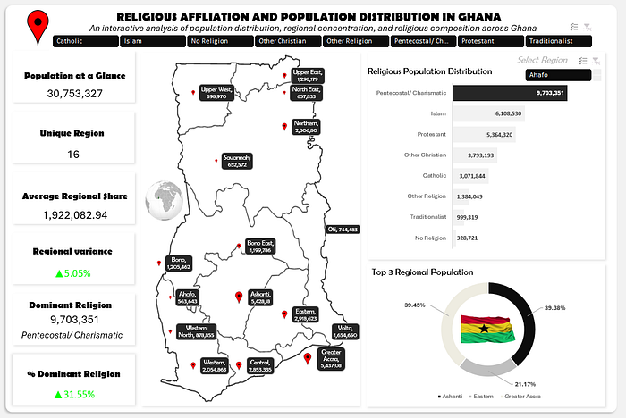
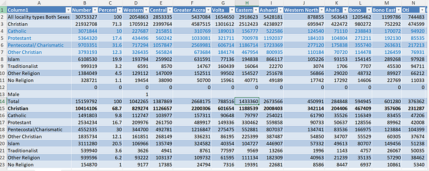
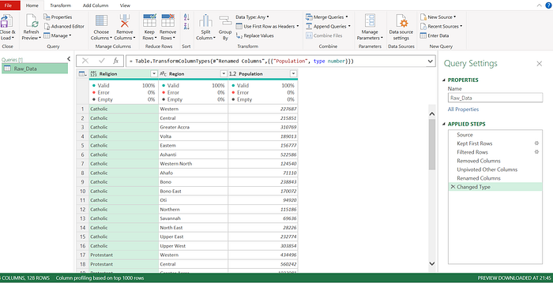
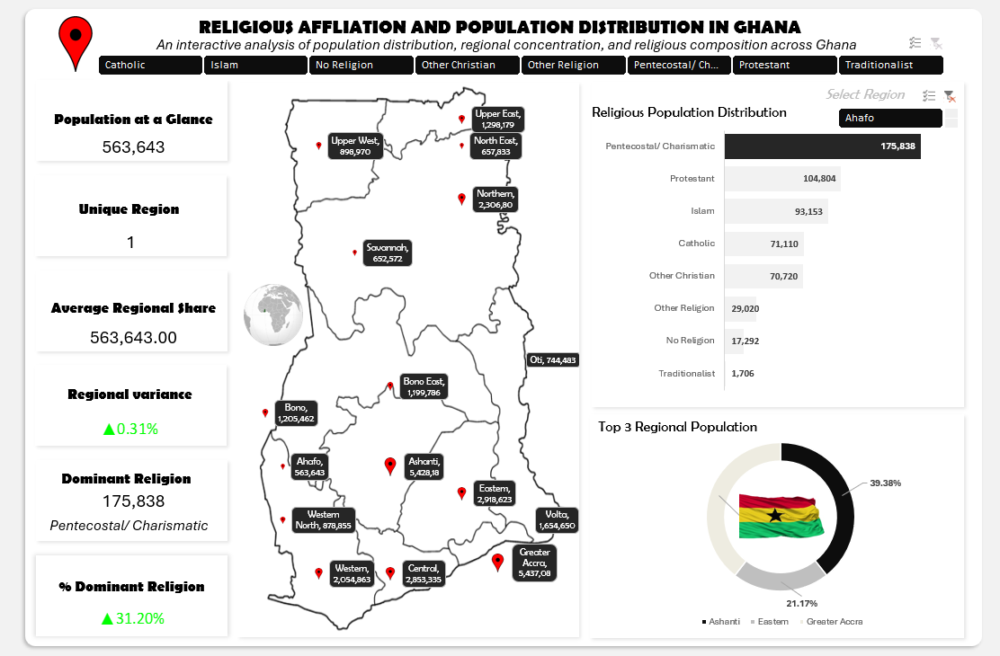

# Religious Affiliation and Population Distribution in Ghana

An interactive Microsoft Excel data analytics project exploring how population and religious affiliation are distributed across Ghana’s 16 administrative regions. The project turns a demographic table into a dashboard that supports regional filtering, affiliation comparison, population ranking, and rapid interpretation.

> **Interpretation note:** Religious affiliation is presented as an aggregate demographic characteristic. It should not be used to make assumptions about individual people or communities.

## Table of Contents

- [Project Overview](#project-overview)
- [Analytical Questions](#analytical-questions)
- [Dashboard Preview](#dashboard-preview)
- [Dataset](#dataset)
- [Data Preparation](#data-preparation)
- [Excel Analysis](#excel-analysis)
- [Dominant Affiliation Logic](#dominant-affiliation-logic)
- [Dashboard Components](#dashboard-components)
- [Key Insights](#key-insights)
- [How to Recreate the Analysis](#how-to-recreate-the-analysis)
- [Repository Contents](#repository-contents)
- [Limitations and Responsible Use](#limitations-and-responsible-use)
- [Source and Attribution](#source-and-attribution)

## Project Overview

Population data becomes more useful when it is organized around questions that decision-makers can answer quickly. This project combines Excel data cleaning, Pivot Tables, derived calculations, and dashboard visualization to examine population concentration and religious composition across Ghana.

The final dashboard is designed as a single-page interactive experience. A user can select a region or religious affiliation and immediately review the selected population, dominant affiliation, religious distribution, regional ranking, and national comparison.

## Analytical Questions

The project is structured around five practical questions:

1. Which Ghanaian regions have the largest populations?
2. How does religious affiliation vary within a selected region?
3. Which affiliation has the largest population in a region or nationally?
4. How concentrated is the population across Ghana’s 16 regions?
5. How can a complex demographic table be communicated through an accessible Excel dashboard?

## Dashboard Preview



The dashboard combines KPI cards, a labeled map of Ghana, a horizontal affiliation ranking, filter tabs, a region selector, and a donut chart for the three most populous regions.

### Additional Illustrations

| Dataset overview | Data cleaning | Pivot analysis |
| --- | --- | --- |
|  |  |  |

## Dataset

The underlying data combines regional population totals with counts for major religious affiliation categories. The regional structure represented in the project includes Ahafo, Ashanti, Bono, Bono East, Central, Eastern, Greater Accra, North East, Northern, Oti, Savannah, Upper East, Upper West, Volta, Western, and Western North.

| Data element | Description |
| --- | --- |
| `Region` | Ghanaian administrative region used for filtering and grouping. |
| `Total Population` | Total population associated with the region. |
| Religious affiliation fields | Population counts for categories such as Pentecostal/Charismatic, Protestant, Islam, Catholic, Other Christian, Other Religion, No Religion, and Traditionalist. |
| Derived measures | Percent share, dominant affiliation, rank, regional variance, and unique-region indicators. |

The source article describes the data as official or census-aligned. When rebuilding the workbook, use the original source dataset or an official Ghana Statistical Service extract, document the exact release, and preserve the source citation alongside the data file.

## Data Preparation

The cleaning workflow is intended to produce a consistent analysis-ready table. Region names should be standardized against the official administrative list, missing and zero values should be treated consistently, and duplicate records should be removed or flagged. Religious affiliation counts should be checked against regional totals within an explicitly documented tolerance.

The workflow also converts counts into comparative percentages, validates category totals, and creates derived fields for ranking and dashboard display. These steps help prevent misleading charts caused by inconsistent labels, hidden zeros, or unexamined duplicates.


## Excel Analysis

Pivot Tables provide the aggregation layer without altering the underlying records. A population-by-region Pivot Table uses `Region` as the row field and the sum of population as the value, producing a regional ranking suitable for the Top 3 visual.

A religious-population Pivot Table uses affiliation as the row field, region as a filter or column field, and population as the value. This enables a selected-region comparison across categories and supports the horizontal bar chart shown in the dashboard.


## Dominant Affiliation Logic

The dashboard needs to return both the largest value and the label associated with that value. If affiliation names are in `E6:E13` and their populations are in `F6:F13`, the dominant affiliation can be returned with:

```excel
=INDEX(E6:E13,MATCH(MAX(F6:F13),F6:F13,0))
```

The corresponding maximum population is returned with:

```excel
=MAX(F6:F13)
```

This pairing is more informative than displaying the maximum number alone because it tells the reader what the number represents.

## Dashboard Components

| Component | Purpose |
| --- | --- |
| KPI cards | Display population at a glance, unique region count, average regional share, regional variance, dominant affiliation, and dominant-affiliation percentage. |
| Ghana regional map | Provides geographic context and labels the regional population distribution. |
| Religious distribution bars | Ranks affiliation categories for the selected region or national view. |
| Filter tabs | Enables rapid switching between affiliation categories. |
| Region selector | Refines the dashboard to a selected region. |
| Top 3 regional population donut | Compares the three most populous regions and communicates their percentage shares. |

## Key Insights

The dashboard preview reports a national population of **30,753,327** across **16 regions**, with an average regional population of approximately **1,922,083**. Pentecostal/Charismatic is presented as the largest affiliation, with **9,703,351 people**, or **31.55%** of the national total.

| National category | Population shown in the project preview |
| --- | ---: |
| Pentecostal/Charismatic | 9,703,351 |
| Islam | 6,108,530 |
| Protestant | 5,364,320 |
| Other Christian | 3,793,193 |
| Catholic | 3,071,844 |
| Other Religion | 1,384,049 |
| Traditionalist | 999,319 |
| No Religion | 328,721 |

For the example Ahafo selection, the dashboard reports a total population of **563,643**. Pentecostal/Charismatic is the largest category at **175,838**, followed by Protestant at **104,804** and Islam at **93,153**.

These values are reproduced from the supplied article’s dashboard narrative and should be revalidated against the underlying dataset before being used for publication, policy analysis, or decision-making.

## How to Recreate the Analysis

Begin with a normalized source table in which each row represents a region and each affiliation category is represented consistently. Standardize labels, validate totals, and add percentage and rank calculations. Create the population-by-region and religious-population Pivot Tables, then connect dashboard charts and KPI cells to the Pivot outputs.

Next, add slicers or filter controls for region and affiliation. Use the `INDEX`/`MATCH` and `MAX` pattern to return the dominant affiliation and its population. Apply consistent number formats, accessible contrast, descriptive chart titles, and a clear hierarchy that makes the selected context obvious.

Finally, test the dashboard with every region, including regions with zero or small values in one or more categories. Record the workbook version, data source, refresh date, and known limitations in the workbook or accompanying documentation.

## Repository Contents

| Path | Description |
| --- | --- |
| `README.md` | Main project documentation and visual walkthrough. |
| `docs/PROJECT_DOCUMENTATION.md` | Extended project brief, workflow, validation checklist, and maintenance notes. |
| `data/README.md` | Data provenance, schema guidance, and instructions for adding a verified workbook or source extract. |
| `assets/` | Local illustrations used throughout the documentation. |

## Limitations and Responsible Use

The repository documents the project described in the supplied article; it does not claim to reproduce or independently verify the original workbook. The accessible article preview did not provide a downloadable `.xlsx` file, so no workbook has been invented or included. The figures shown here should be treated as project-preview values until checked against an official source extract.

Religious categories may reflect survey or census definitions, response choices, timing, and classification rules. Comparisons across regions should therefore preserve the source methodology and avoid implying that aggregate affiliation data describes individual beliefs, practice, identity, or behavior.

## Source and Attribution

This project is based on Adeyemi Adenuga’s article, [Religious Affiliation and Population Distribution in Ghana: An Interactive Excel Data Analytics Project](https://medium.com/@adeyemi.da/religious-affiliation-and-population-distribution-in-ghana-an-interactive-excel-data-analytics-3e18a5de1edf).

The illustrations in `assets/` were downloaded from the image URLs embedded in the original Medium article and are retained for documentation and illustration purposes. They should remain attributed to the original publication, and their reuse should comply with the original author’s rights and licensing terms.

### References

[1]: [Adenuga, Adeyemi. “Religious Affiliation and Population Distribution in Ghana: An Interactive Excel Data Analytics Project.” Medium.](https://medium.com/@adeyemi.da/religious-affiliation-and-population-distribution-in-ghana-an-interactive-excel-data-analytics-3e18a5de1edf)

[2]: [Ghana Statistical Service, StatsBank: Population by Religious Affiliation, District, Region, Type of Locality, Age, Sex, and Education.](https://statsbank.statsghana.gov.gh/pxweb/en/PHC%202021%20StatsBank/PHC%202021%20StatsBank__Population/religion_table.px/)
